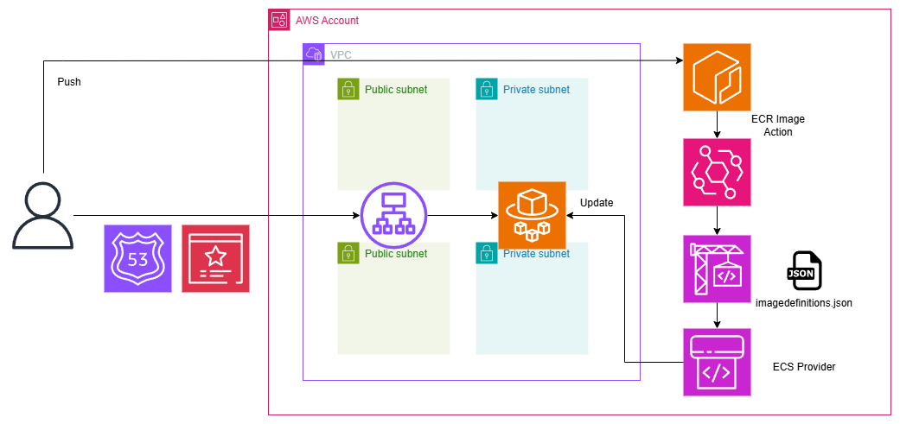

# fargate-codepipeline
Terraform example where CodePipeline starts and automatically replaces Fargate when pushed to ECR



## How to push
```
cd docker

aws ecr get-login-password --region ap-northeast-1 --profile {aws_profile_name} | docker login --username AWS --password-stdin {aws_account_id}.dkr.ecr.ap-northeast-1.amazonaws.com


docker build -t {aws_account_id}.dkr.ecr.ap-northeast-1.amazonaws.com/streamlit-app:latest .


docker push {aws_account_id}.dkr.ecr.ap-northeast-1.amazonaws.com/streamlit-app:latest
```